# The Sauce

Deployed site: https://vfg-95.github.io/the-sauce/

The Sauce is a cooking and recipe website which aims its content at younger/inexperienced cooks (especially students) and has an emphasis on sustainability with their cooking. The site will target them by providing cheap and easy recipes in an informal style, as well as share useful tips/content useful to people new to cooking. The site should appeal to its demographic for two main reasons. Firstly, generally speaking, many young people and students in particular will be cooking properly themselves for the first time and will want to keep costs down in the process. Secondly, younger generations are stated to be more concerned with sustainability in their lives.

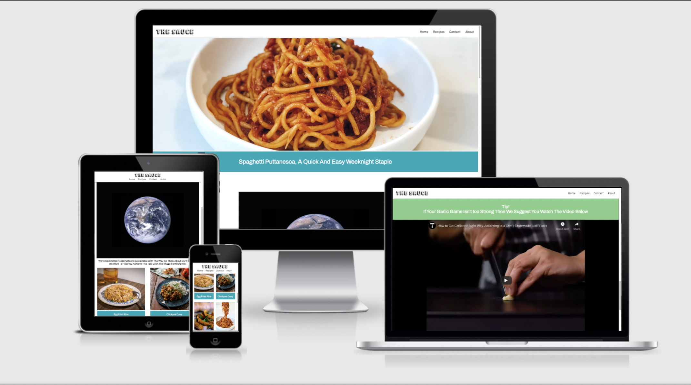

## Contents

1. [Aims](#aims)
    - [Organisation Aims](#organisation-aims)
    - [User Stories](#user-stories)
    - [Target Audience](#target-audience)
2. [Features](#features)
    - [Navigation Bar](#navigation-bar)
    - [Featured Recipe](#featured-recipe)
    - [Sustainable Section](#sustainable-section)
    - [Recipe Section](#recipe-section)
    - [Garlic Tip Section](#garlic-tip-section)
    - [Sign Up Section](#sign-up-section)
    - [Footer](#footer)
    - [Sustainability Page](#sustainability-page)
    - [Recipe Pages](#recipe-pages)
    - [Contact Page](#contact-page)
    - [About Us Page](#about-us-page)
    - [Sign Up Confirm Page](sign-up-confirm-page)
3. [Design](#design)
    - [Colour](#colour)
    - [Imagery](#imagery)
    - [Fonts](#fonts)
    - [Structure](#structure)
4. [Testing](#testing)
    - [Process](#process)
5. [Lighthouse Testing](#lighthouse-testing)
6. [Validator Testing](#validator-testing)
7. [Fixes](#fixes)
8. [Deployment](#deployment)
9. [Credits](#credits)
10. [Media](#media)

## Aims

### Organisation Aims
- Engage new cooks and help them to start cooking for themselves
- Encourage sustainable eating with vegetarian and vegan options and emphasis on minimising waste
- Have a site which conveys it's intentions through it's design
- Allow users to contribute to the site

### User Stories
- The user wants to immediately know the purpose of the site
- The user wants to buy into the ethos of the site
- The user want to be able to quickly and easily navigate the site
- The user wants to know the time and cost involved with a recipe
- The user wants simple and concise instructions/information
- The user wants the site to be phone friendly

### Target Audience
- Younger people & students - but still suitable/accessible for any age if they are new to cooking
- People who have not yet discovered their passion for food & cooking
- People with a care for sustainability in their lives

## Features

### Navigation Bar
- The navigation bar immediately gives the user the option to navigate to the most important part of the site (recipes) as well as the commonly found links to contact, about as well as home. These are clear and easily tappable for phone users
- This meets the 1st 3rd & 6th user stories

### Featured Recipe
- The landing page makes use of a big featured recipe image at the top of the page, and also shows the very top of the next section, encouraging the user to scroll down.
- This meets the 1st & 6th user stories

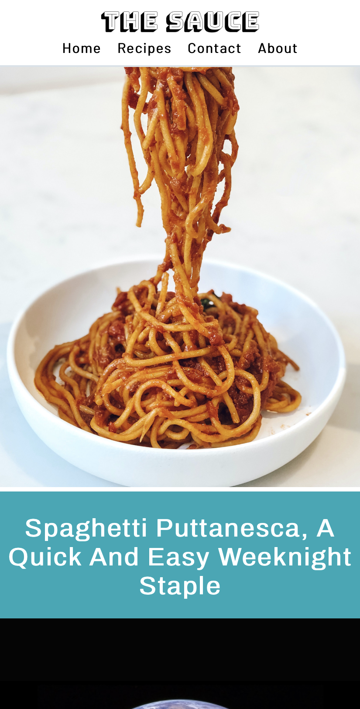

### Sustainable Section
- The image of the world is a clear separation from the rest of the content on the page/site and is what conveys the sustainable part of the sites aim & ethos
- This meets the 2nd user story

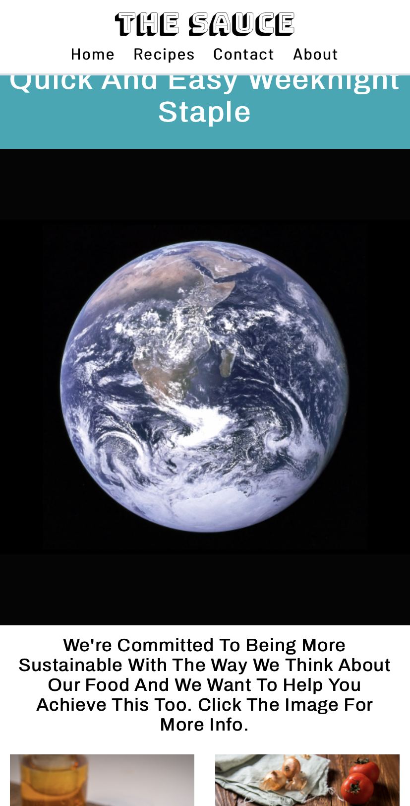

### Recipe Section
- The recipe images invite the user to click on them for more info, whilst also providing them with the options of actual recipes themselves
- The meets the 3rd, 5th & 6th user stories

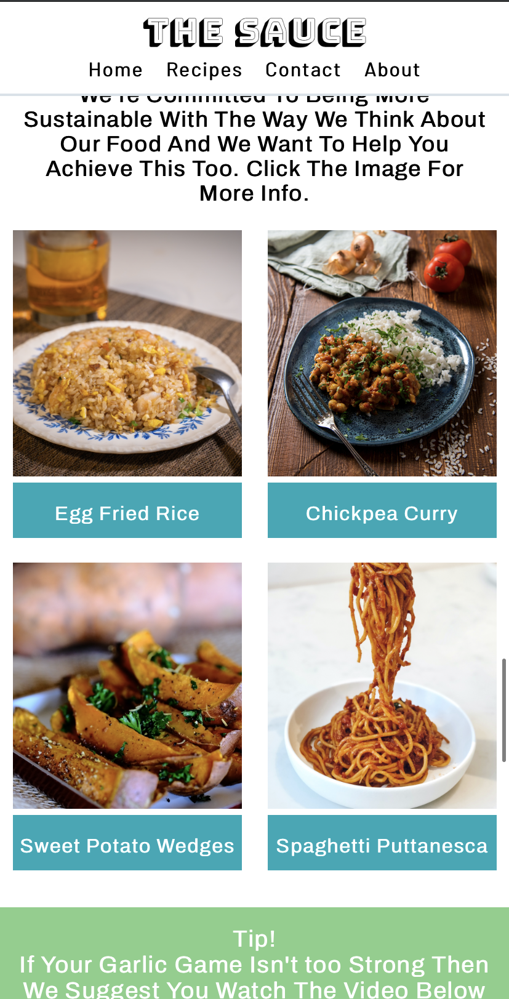

### Garlic Tip Section

- The YouTube video shared will be very helpful for those new to cooking, providing them with visual tips which they can watch on their phone whilst in the process of cooking
- This meets the 5th & 6th user stories

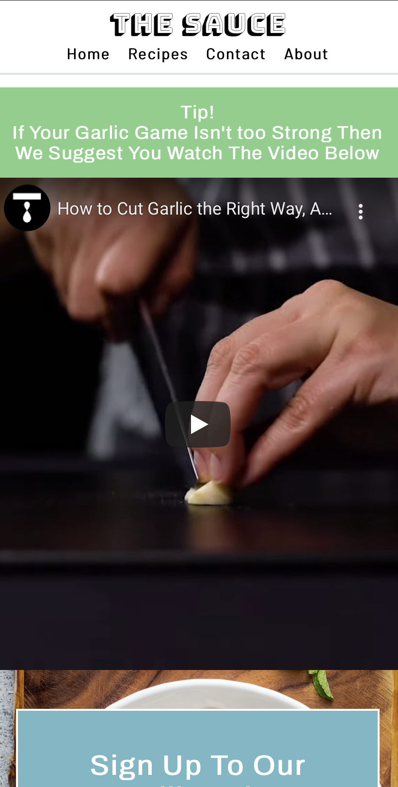

### Sign Up Section

- Allows the user to receive all the latest recipe and tips updates to the site
- Meets 4th & 5th user stories 

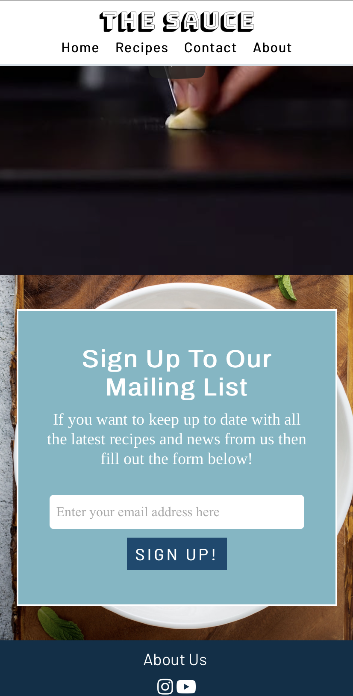

### Footer

- Allows the user to easily access the about us page and also the sites social media accounts

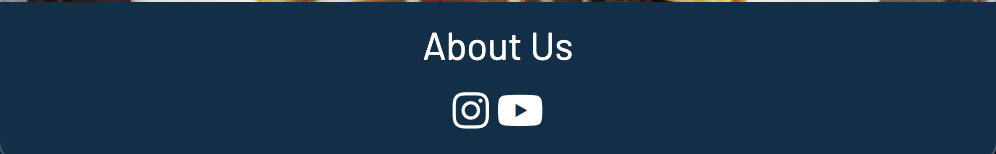

### Sustainability Page

- Provides the user with useful tips which support the aims of the site and appeal to the target audience
- Meets the 2nd & 5th user stories

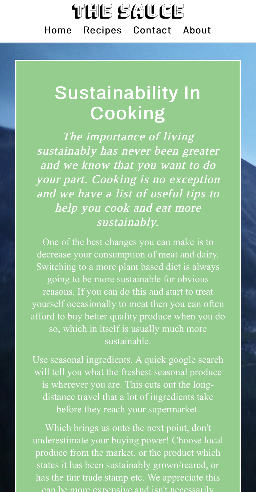

### Recipe Pages

- Provide the user with the main aim of the site which is recipes that also fit the other criteria (cheap, easy, sustainable)
- Clearly displays time and cost involved, whilst also giving tips to achieve better sustainability
- Meets the 2nd, 4th, 5th & 6th user stories

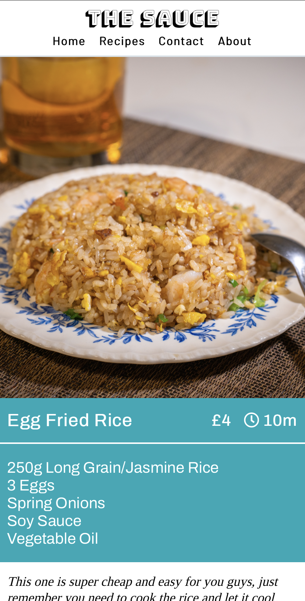

### Contact Page

- Allows the user to get in touch with us and have some potential input into the site
- This meets the 4th organisational aim

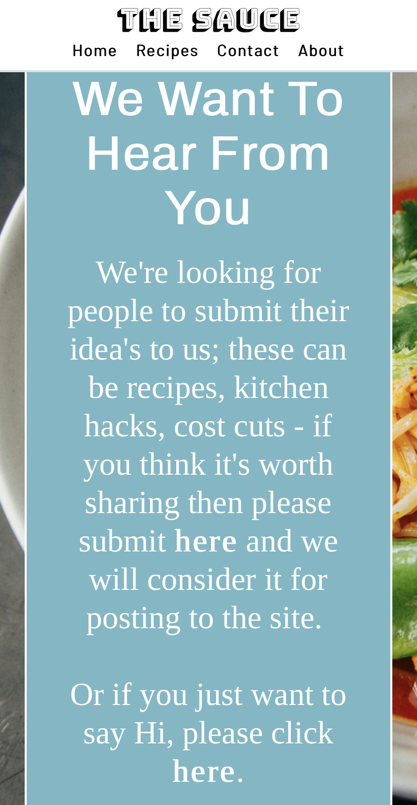

### About Us Page

- This is the direct way of reinforcing what the website stands for and aims to provide for it's users
- This meets the 1st, 2nd and 5th user stories

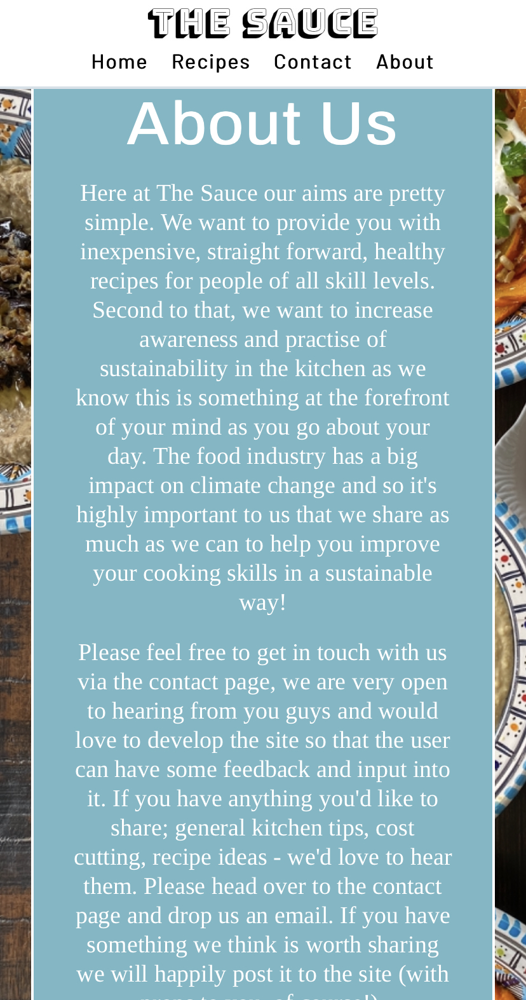

### Sign Up Confirm Page

- This is the responsive way to let the user know they have been successfully signed up to the mailing list and what they can expect to receive from it

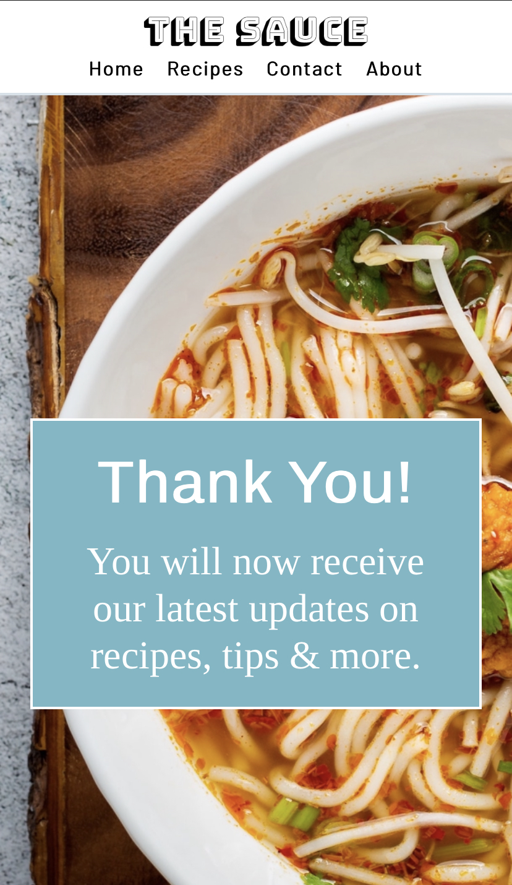

## Design

I made up some wireframe images which just gave me a basic guide of how I intended to structure the site and the content to flow.

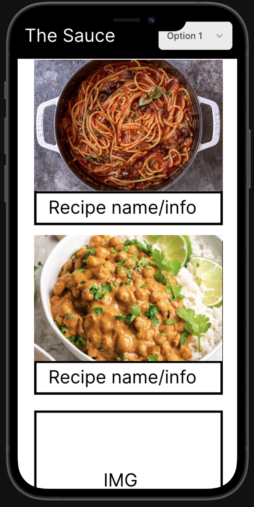
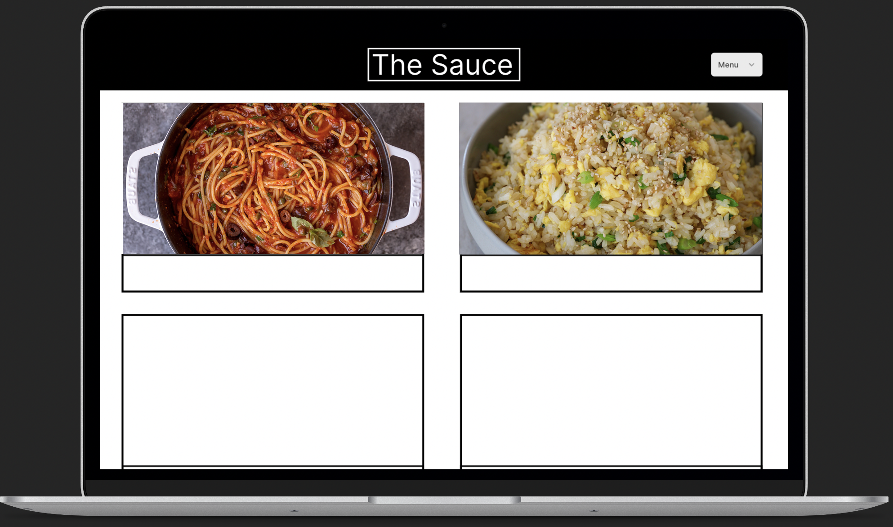

I decided to go for a mobile first design approach for two reasons; firstly with my target audience being younger they would be more likely to browse from their phone. This is amplified by the fact that when cooking in a kitchen using a phone is much more convenient to look at than a laptop, with a desktop being highly unlikely to be used at all whilst actually cooking.

As you can see from the wireframes my initial idea was to mimic a social media style feed on mobile, primarily Instagram as this is the most prevalent social media app used by the target audience. However once I got together the images and content I intended to use I played around with structure etc to come up with something different but maintained the scrollable aspect of an app like Instagram.

### Colour

I then moved onto colour scheme which I knew was going to be very important. I decided to use Earth tones (sky/sea blue, grass green) as this achieved the organisational aim of conveying its intentions through its design. This is because of the emphasis on sustainability which the colour scheme matches perfectly, and helps the user buy into the ethos of the site. The colours are also split into categories - the turquoise/sea blue colour is used to reference anything to do with actual recipes. Sky blue is for anything to do with contact information, and finally the green is for general tips. This can be continued into the future development of the site when any new content is added. You can see these from the screenshots below.

  

### Imagery

In terms of the imagery used these are fairly self explanatory as they are images for the recipes provided, or background shots of meals which aren't recipes on the site but of course tie in with the theme and purpose. The image of the Earth from space and also the background of the sustainability page are ones you wouldn't necessarily expect to see on a food website, however again for the target audience they help them buy into the sites aims.

### Fonts

I added quite a few different google fonts so I could play around with them and find a mixture that I thought fit the site. I knew I wanted clean and modern looking fonts for headings, and I ended up using Barlow for the header and footer and then using Archivo for the headings on the site. These made sense as it is a site aimed at a younger target audience and so modern works well. I contrasted this with the Tino font used for paragraph text, which works well as a balance of Serif and San-Serif fonts and gives clear separation between text.

### Structure

The main idea with structure was to get the main points of the website across as soon as the user landed on the site. I think this is achieved very well by just the imagery alone, even if the user just looks at the photos they immediately see a big photo of food followed by Earth from space. The two main points of the website are conveyed in their respective priority of order; a cooking website, with a care for the Earth & sustainability. 

## Testing

For the testing process I made use of Google Chrome Dev to test the following devices for site responsivity:

-   Moto G4
-   Galaxy S5
-   Pixel 2
-   Pixel 2 XL
-   iPhone 5/SE
-   iPhone 6/7/8
-   iPhone 6/7/8 Plus
-   iPhone X
-   iPad
-   iPad Pro
-   13" MacBook
-   16" MacBook
-   21" iMac
-   27" iMac

I then used my phone (iPhone XR) and laptop (MacBook Air 13") to test the following browsers:

- Chrome
- Safari
- Firefox
- Edge

## Process

- The first task in testing was to check that all links on the site worked as expected, I found no problems with these across all 4 browsers.

- I then checked that the mail sign up section and button was working so that it took me through to the sign up confirmation page, as well as made sure the email was required before it let you submit. This worked across all browsers.

- Next I tested the responsivity of pseudo classes I used, and here I found some problems (see fix section)

- Last I checked fonts were displaying as expected across all 4 browsers, which they were.

## Lighthouse Testing

My results for desktop came back positive, apart from best practises which seemed to have an issue with the youtube video and security.

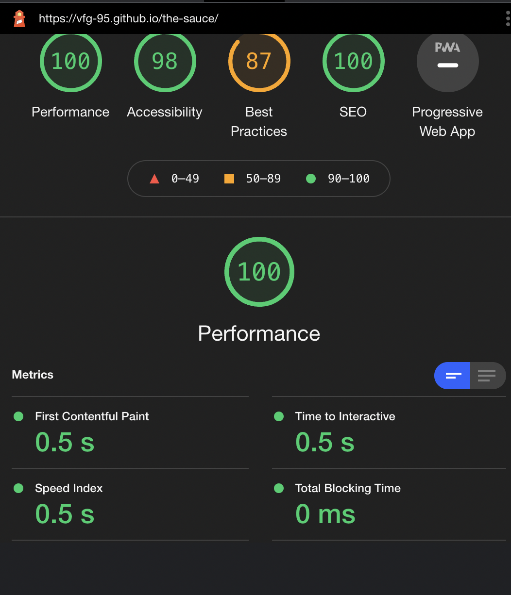

For mobile I initially received the following result

However I went back and made some changes to the size of the images which is where it suggested a lot of the issues were, which did improve the performance. Unfortunately the best practises was still effected by the same issues as on desktop regarding the youtube video.

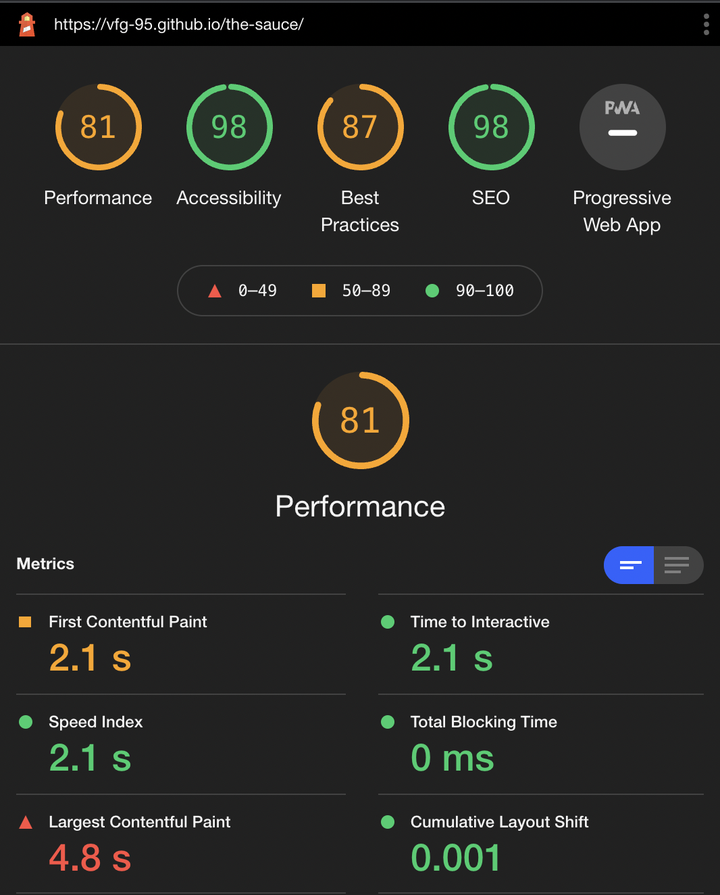

## Validator Testing

Both HTML and CSS passed the W3C HTML and Jisgaw Css validators

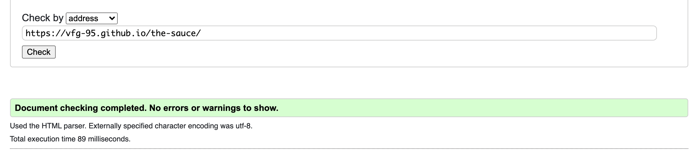

## Fixes

I realised when testing on my phone that I had used the wrong type of pseudo classes as I was developing the site on my laptop I had used the :hover pseudo class. On a mobile there is no way to hover and so I changed these to :active instead, and used the media queries to keep the :hover classes on desktop screens.

The success of these on mobile is slightly different depending on the browser used, however there is no negative effect to keeping them and on some browsers they work quite well.

## Deployment

I deployed the site using GitHub pages, with the steps as follows:

- Go to the settings tab of the GitHub repository
- Click on the pages tab
- Chose the main branch on the source dropdown menu
- The site refreshes and provides you with the live link for the site

## Credits

- Information on how to make iframes responsive was found on [W3schools](https://www.w3schools.com/howto/howto_css_responsive_iframes.asp)
- I learnt about flexbox usage on [MDNWebDocs](https://developer.mozilla.org/en-US/docs/Web/CSS/CSS_Flexible_Box_Layout/Basic_Concepts_of_Flexbox)
- I learnt about pseudo classes on [MDNWebDocs](https://developer.mozilla.org/en-US/docs/Web/CSS/Pseudo-classes)
- Icons were taken from [FontAwsome](https://fontawesome.com/v5.15/icons?d=gallery&p=2)

## Media

- All images and photos for the site were taken from [Unsplash](https://unsplash.com/)
- The YouTube Video was shared from the account [Tastemade](https://www.youtube.com/watch?v=kgEXHeovHdU)

