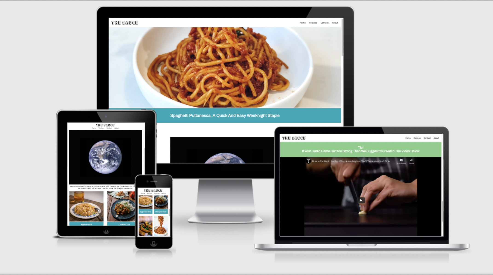

# The Sauce

Deployed site: https://vfg-95.github.io/the-sauce/

The Sauce is a cooking and recipe website which aims it's content at younger/inexperienced cooks (especially students) and has an emphasis on sustainability with their cooking. The site will target them by providing cheap and easy recipes in an informal style, as well as share useful tips/content useful to people new to cooking. The site should appeal to it's demographic for two main reasons. Firstly, generally speaking, many young people and students in particular will be cooking properly themseleves for the first time and will want to keep costs down in the process. Secondly, younger generations are stated to be more concerned with sustainability in their lives.

## Aims

### Organisation Aims
- Engage new cooks and help them to start cooking for themselves
- Encourage sustainable eating with vegetarian and vegan options and emphasis on minimising waste
- Have a site which conveys it's intentions through it's design
- Allow users to contribute to the site

### User Stories
- The user wants to immediately know the purpose of the site
- The user wants to buy into the ethos of the site
- The user want to be able to quickly and easily navigate the site
- The user wants to know the time and involved with a recipe
- The user wants simple and concise instructions/information
- The user wants the site to be phone friendly

### Target Audience
- Younger people & students - but still suitable/accessable for any age if they are new to cooking
- People who have not yet discovered their passion for food & cooking
- People with a care for sustainability in their lives

